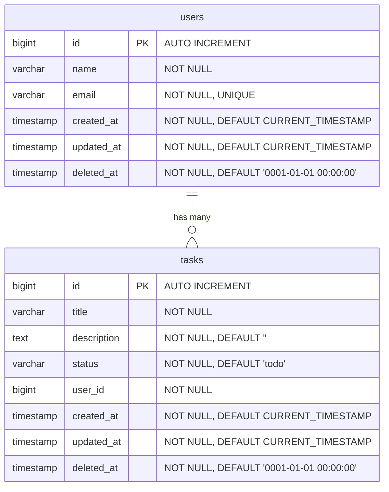

# Claude Task App

## プロジェクト概要

シンプルなタスク管理アプリ。Claude Codeを最大限活用して開発する。

## 技術スタック

| カテゴリ                   | 技術                    | 備考                                |
| -------------------------- | ----------------------- | ----------------------------------- |
| フロントエンド             | Next.js 15 (App Router) | React ベースのフレームワーク        |
| フロントエンド言語         | TypeScript              |                                     |
| スタイリング               | Tailwind CSS            |                                     |
| パッケージマネージャ       | npm                     |                                     |
| バックエンド言語           | Go                      |                                     |
| バックエンドフレームワーク | Echo                    | 軽量な Web フレームワーク           |
| ORM                        | GORM                    |                                     |
| データベース               | PostgreSQL              |                                     |
| API スキーマ               | OpenAPI 3.0             | YAML で定義                         |
| コード生成                 | oapi-codegen            | OpenAPI → Go ハンドラーIF 生成      |
| テストライブラリ           | go-testfixtures         | YAML Fixture によるテストデータ投入 |
| テスト比較                 | go-cmp                  | 構造体の差分比較                    |

## プロジェクト構造

```
claude-task-app/
├── frontend/              # Next.js フロントエンド
│   └── src/
│       ├── app/           # App Router (ページ・レイアウト)
│       ├── components/    # UIコンポーネント
│       ├── lib/           # ユーティリティ (API クライアント等)
│       └── types/         # 型定義
├── api/
│   └── openapi.yaml       # OpenAPI スキーマ定義
├── backend/               # Go バックエンド (クリーンアーキテクチャ)
│   ├── cmd/
│   │   ├── server/
│   │   │   └── main.go    # エントリポイント・DI
│   │   └── migrate/
│   │       └── main.go    # DBマイグレーション実行
│   ├── gen/               # oapi-codegen 自動生成コード (編集禁止)
│   ├── domain/            # Enterprise Business Rules
│   │   ├── entity/        # エンティティ (ビジネスオブジェクト)
│   │   └── repository/    # リポジトリインターフェース
│   │       └── mock/      # リポジトリモック (usecase テスト用)
│   ├── usecase/           # Application Business Rules
│   │   ├── task/          # タスク関連ユースケース
│   │   │   └── mock/      # タスク usecase モック (handler テスト用)
│   │   └── user/          # ユーザー関連ユースケース
│   │       └── mock/      # ユーザー usecase モック (handler テスト用)
│   ├── adapter/           # Interface Adapters
│   │   └── handler/       # Echo ハンドラー (生成IFの実装)
│   ├── infrastructure/    # Frameworks & Drivers
│   │   ├── persistence/   # GORM リポジトリ実装
│   │   │   └── testdata/  # テスト用 Fixture (YAML)
│   │   ├── router/        # Echo ルーティング定義
│   │   └── config/        # 設定・環境変数
│   └── e2e/               # E2Eテスト (全層通し)
├── docs/                  # ドキュメント
│   └── phases             # 各フェーズの作業記録
└── CLAUDE.md
```

## コーディング規約

### フロントエンド

- 関数コンポーネントを使用する
- Server Components をデフォルトとし、必要な場合のみ "use client" を使う
- 変数名・関数名は camelCase、コンポーネント名は PascalCase

### バックエンド (クリーンアーキテクチャ)

- Go の標準的な命名規則に従う (exported は PascalCase、unexported は camelCase)
- **依存の方向は外側→内側のみ** (infrastructure → adapter → usecase → domain)
- domain 層は他の層に依存しない (標準ライブラリのみ使用可)
- usecase 層は domain 層で定義したインターフェースに依存する
- infrastructure 層で domain のリポジトリインターフェースを実装する
- DI (依存性注入) は `cmd/server/main.go` で手動で行う
- エラーは適切にラップして返す
- `gen/` 配下の自動生成コードは手動で編集しない
- API変更時は openapi.yaml を先に更新し、oapi-codegen で再生成する
- **エラーハンドリング戦略**: infrastructure 層で `gorm.ErrRecordNotFound` を `entity.ErrNotFound` でラップして返す。usecase 層は受け取ったエラーをそのまま `fmt.Errorf` でコンテキストを付けてラップして返す。handler 層で `errors.Is(err, entity.ErrNotFound)` により 404 を判断する
- **センチネルエラーの配置方針**:
  - usecase 層が参照するセンチネルエラー（ビジネスロジックのエラー）は `domain/entity` で定義・管理する（例: `entity.ErrNotFound`）
  - HTTP レイヤー固有のセンチネルエラー（バリデーション失敗・不正リクエスト等）は `adapter/handler` で定義・管理する
- **DELETE の冪等性**: リソース削除は存在確認を行わず常に 204 を返す（冪等操作）

### バックエンドテスト

- テストは **テーブルドリブンテスト** で書く（正常系・異常系をサブテストで網羅）
- テストデータは各テストケースに直接定義する（グローバル変数での共有は避ける）
- DB接続は `TestMain` で1回だけ行い、パッケージ変数 `testDB` で保持する
- テストデータは **go-testfixtures** で YAML ファイルから投入する（`testdata/` 配下）
- DBを変更するテスト（Create/Update/Delete）は各サブテストの `setup` でDB状態を初期化する
- 読み取り専用テスト（Find系）はテスト関数の先頭で1回 `loadFixture` すれば十分
- `t.Cleanup` でテスト後にテーブルをクリーンアップする
- 構造体の比較には **go-cmp** を使用し、動的フィールド（CreatedAt 等）は `cmpopts.IgnoreFields` で除外する

### 共通

- 日本語コメントOK

## コマンド

### フロントエンド

- `npm run dev` — 開発サーバー起動
- `npm run build` — ビルド
- `npm run lint` — Lint実行

### バックエンド

- `go generate ./...` — oapi-codegen によるコード生成
- `go run cmd/server/main.go` — 開発サーバー起動
- `go build` — ビルド
- `go test ./...` — テスト実行

## 機能一覧

### ユーザー管理

| 機能         | メソッド | エンドポイント      | 説明               |
| ------------ | -------- | ------------------- | ------------------ |
| ユーザー登録 | POST     | `/api/v1/users`     | 新規ユーザーを作成 |
| ユーザー変更 | PUT      | `/api/v1/users/:id` | ユーザー情報を更新 |

### タスク管理

| 機能       | メソッド | エンドポイント      | 説明             |
| ---------- | -------- | ------------------- | ---------------- |
| タスク登録 | POST     | `/api/v1/tasks`     | 新規タスクを作成 |
| タスク一覧 | GET      | `/api/v1/tasks`     | タスク一覧を取得 |
| タスク詳細 | GET      | `/api/v1/tasks/:id` | タスク詳細を取得 |
| タスク変更 | PUT      | `/api/v1/tasks/:id` | タスクを更新     |
| タスク削除 | DELETE   | `/api/v1/tasks/:id` | タスクを削除     |

## DB 設計ルール

- カラムは原則 NOT NULL 制約を付ける
- `created_at`, `updated_at` は全テーブル共通。初期値は `CURRENT_TIMESTAMP`
- `deleted_at` は全テーブル共通。初期値は timestamp 型のゼロ値 (`0001-01-01 00:00:00`)
- データ削除は**論理削除**方式とし、`deleted_at` を `CURRENT_TIMESTAMP` に更新する
- **外部キー制約は使用しない**（テーブル間の依存をDBレベルで強制せず、アプリケーション層で整合性を担保する）
  - FK カラム（例: `user_id`）は保持するが、DB の FOREIGN KEY 制約は作成しない
  - GORM の `DisableForeignKeyConstraintWhenMigrating: true` を設定
  - マイグレーション時に既存の FK 制約があれば自動削除する

## DB スキーマ (ER図)



## インフラ構成 (WIP)

| コンポーネント | サービス                | 備考   |
| -------------- | ----------------------- | ------ |
| バックエンド   | AWS ECS (Fargate) + ALB |        |
| データベース   | AWS RDS (PostgreSQL)    |        |
| フロントエンド | AWS Amplify or ECS      | 未決定 |

> **現在のスコープ**: ローカル環境で動作するところまで。インフラ構築は後続フェーズで対応。

## 開発フェーズ

開発は以下の工程で進めます。

### Phase 1: プロジェクト基盤整備

- [ ] 1-1. Git リポジトリ初期化・`.gitignore` 作成
- [ ] 1-2. Go モジュール初期化・依存パッケージ導入
- [ ] 1-3. Docker Compose で PostgreSQL 環境構築
- [ ] 1-4. PostgreSQL 接続確認
- [ ] 1-5. Next.js プロジェクト初期化
- [ ] 1-6. コード・CLAUDE.md レビュー

### Phase 2: バックエンド domain 層実装（スキーマ駆動開発）

- [ ] 2-1. OpenAPI スキーマ定義 (`api/openapi.yaml`)
- [ ] 2-2. oapi-codegen セットアップ・コード生成
- [ ] 2-3. domain 層実装 (entity, repository IF)
- [ ] 2-3. domain 層 センチネルエラー実装 (entity, repository IF)
- [ ] 2-4. DB スキーマ定義 (Mermaid ER図)
- [ ] 2-5. GORM モデル・マイグレーション実装
- [ ] 2-6. infrastructure 層実装 (GORM リポジトリ, DB接続)
- [ ] 2-7. テスト基盤構築 (TestMain, loadFixture, truncateTable, go-testfixtures 導入)
- [ ] 2-8. テストデータ作成 (YAML Fixture)
- [ ] 2-9. repository 層の結合テスト実装 (テーブルドリブンテスト、正常系・異常系)
- [ ] 2-10. Phase 2のコマンドをMakefileに登録
- [ ] 2-11. コード・CLAUDE.md レビュー

### Phase 3: バックエンド実装（ロジック・E2Eテスト）

- [x] 3-1. usecase 層実装
- [x] 3-2. usecase 層のテストデータ・モック作成
- [x] 3-3. usecase 層のユニットテスト (リポジトリをモックして検証)
- [x] 3-4. adapter 層実装 (handler)
- [x] 3-5. handler 層のテストデータ・モック作成
- [x] 3-6. handler 層のテスト (usecase をモックし、HTTPリクエスト/レスポンスを検証)
- [x] 3-7. DI・ルーティング結合 (`main.go`)
- [x] 3-8. E2E テスト (サーバー起動→全エンドポイントを通しで検証)
- [x] 3-9. コード・CLAUDE.md レビュー

### Phase 4: フロントエンド実装

- [ ] 4-1. API クライアント作成
- [ ] 4-2. ユーザー管理画面 (登録・編集)
- [ ] 4-3. タスク管理画面 (一覧・登録・詳細・編集・削除)
- [ ] 4-4. フロント ↔ バックエンド結合動作確認
- [ ] 4-5. コード・CLAUDE.md レビュー

### Phase 5: AWS インフラ構築 (WIP)

- [ ] 5-1. ECS + ALB でバックエンドデプロイ
- [ ] 5-2. RDS (PostgreSQL) セットアップ
- [ ] 5-3. フロントエンドデプロイ (Amplify or ECS — 未決定)
- [ ] 5-4. コード・CLAUDE.md レビュー

## テスト方針（バックエンド）

| テスト種別       | 対象層                     | 手法                            | 目的                                 |
| ---------------- | -------------------------- | ------------------------------- | ------------------------------------ |
| ユニットテスト   | usecase                    | リポジトリIF をモック           | ビジネスロジックの正しさを検証       |
| 結合テスト       | infrastructure/persistence | テスト用 PostgreSQL を使用      | 実際のDB操作が正しく動くか検証       |
| ハンドラーテスト | adapter/handler            | usecase をモック、httptest 使用 | HTTP I/O の正しさを検証              |
| E2E テスト       | 全層                       | テストサーバー起動、実DB接続    | エンドポイント単位で全体を通しで検証 |

## 開発ルール

- フロントエンドからバックエンドへの通信はREST APIで行う
- API変更時は openapi.yaml → oapi-codegen → handler 実装の順に行う
- 機能追加時は domain → usecase → adapter → infrastructure の順に実装する
- GORM モデルは infrastructure/persistence に置き、domain/entity とは分離する
- APIエンドポイントは `/api/v1/` プレフィックスを付ける
- エラーハンドリングは適切に行う
- テストは各層の実装と合わせて書く（実装後にまとめて書かない）
- 各タスク完了時に `docs/phases/phase{N}/{N}-{M}_{slug}.md` に作業記録を残す
  - 例: `docs/phases/phase1/1-1_git-init.md`
- 作業記録を残してからコミットする（記録→コミットの順）
- タスク1つ完了ごとに1コミットする（例: 1-1 完了→コミット、1-2 完了→コミット）
- Phase の実行は `/pm {Phase番号}` スキルで開始する（タスク管理・オーケストレーション）
- タスクの実装・作業記録は `/engineer {タスク番号}` スキルで実施する
- 各 Phase の最終タスク「コード・CLAUDE.md レビュー」は `/reviewer {タスク番号}` スキルで実施する
