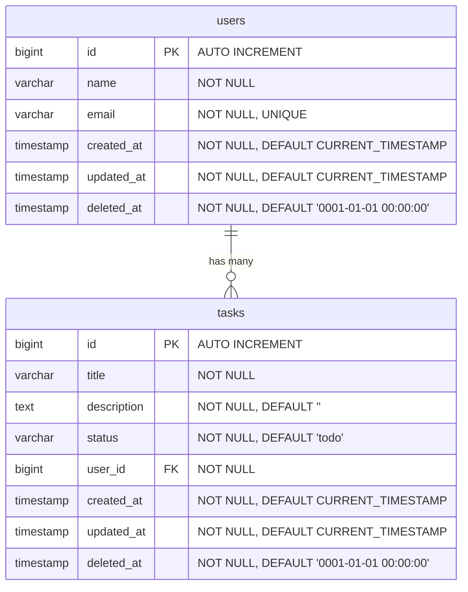

# Claude Task App

## プロジェクト概要
シンプルなタスク管理アプリ。Claude Codeを最大限活用して開発する。

## 技術スタック

| カテゴリ | 技術 | 備考 |
|---------|------|------|
| フロントエンド | Next.js 15 (App Router) | React ベースのフレームワーク |
| フロントエンド言語 | TypeScript | |
| スタイリング | Tailwind CSS | |
| パッケージマネージャ | npm | |
| バックエンド言語 | Go | |
| バックエンドフレームワーク | Echo | 軽量な Web フレームワーク |
| ORM | GORM | |
| データベース | PostgreSQL | |
| API スキーマ | OpenAPI 3.0 | YAML で定義 |
| コード生成 | oapi-codegen | OpenAPI → Go ハンドラーIF 生成 |

## プロジェクト構造
```
claude-task-app/
├── frontend/              # Next.js フロントエンド
│   └── src/
│       ├── app/           # App Router (ページ・レイアウト)
│       ├── components/    # UIコンポーネント
│       ├── lib/           # ユーティリティ (API クライアント等)
│       └── types/         # 型定義
├── api/
│   └── openapi.yaml       # OpenAPI スキーマ定義
├── backend/               # Go バックエンド (クリーンアーキテクチャ)
│   ├── cmd/
│   │   └── server/
│   │       └── main.go    # エントリポイント・DI
│   ├── gen/               # oapi-codegen 自動生成コード (編集禁止)
│   ├── domain/            # Enterprise Business Rules
│   │   ├── entity/        # エンティティ (ビジネスオブジェクト)
│   │   └── repository/    # リポジトリインターフェース
│   ├── usecase/           # Application Business Rules
│   │   └── task/          # タスク関連ユースケース
│   ├── adapter/           # Interface Adapters
│   │   ├── handler/       # Echo ハンドラー (生成IFの実装)
│   │   └── presenter/     # レスポンス整形
│   └── infrastructure/    # Frameworks & Drivers
│       ├── persistence/   # GORM リポジトリ実装
│       ├── router/        # Echo ルーティング定義
│       └── config/        # 設定・環境変数
└── CLAUDE.md
```

## コーディング規約

### フロントエンド
- 関数コンポーネントを使用する
- Server Components をデフォルトとし、必要な場合のみ "use client" を使う
- 変数名・関数名は camelCase、コンポーネント名は PascalCase

### バックエンド (クリーンアーキテクチャ)
- Go の標準的な命名規則に従う (exported は PascalCase、unexported は camelCase)
- **依存の方向は外側→内側のみ** (infrastructure → adapter → usecase → domain)
- domain 層は他の層に依存しない (標準ライブラリのみ使用可)
- usecase 層は domain 層で定義したインターフェースに依存する
- infrastructure 層で domain のリポジトリインターフェースを実装する
- DI (依存性注入) は `cmd/server/main.go` で手動で行う
- エラーは適切にラップして返す
- `gen/` 配下の自動生成コードは手動で編集しない
- API変更時は openapi.yaml を先に更新し、oapi-codegen で再生成する

### 共通
- 日本語コメントOK

## コマンド

### フロントエンド
- `npm run dev` — 開発サーバー起動
- `npm run build` — ビルド
- `npm run lint` — Lint実行

### バックエンド
- `go generate ./...` — oapi-codegen によるコード生成
- `go run cmd/server/main.go` — 開発サーバー起動
- `go build` — ビルド
- `go test ./...` — テスト実行

## 機能一覧

### ユーザー管理
| 機能 | メソッド | エンドポイント | 説明 |
|------|---------|---------------|------|
| ユーザー登録 | POST | `/api/v1/users` | 新規ユーザーを作成 |
| ユーザー変更 | PUT | `/api/v1/users/:id` | ユーザー情報を更新 |

### タスク管理
| 機能 | メソッド | エンドポイント | 説明 |
|------|---------|---------------|------|
| タスク登録 | POST | `/api/v1/tasks` | 新規タスクを作成 |
| タスク一覧 | GET | `/api/v1/tasks` | タスク一覧を取得 |
| タスク詳細 | GET | `/api/v1/tasks/:id` | タスク詳細を取得 |
| タスク変更 | PUT | `/api/v1/tasks/:id` | タスクを更新 |
| タスク削除 | DELETE | `/api/v1/tasks/:id` | タスクを削除 |

## DB 設計ルール
- カラムは原則 NOT NULL 制約を付ける
- `created_at`, `updated_at` は全テーブル共通。初期値は `CURRENT_TIMESTAMP`
- `deleted_at` は全テーブル共通。初期値は timestamp 型のゼロ値 (`0001-01-01 00:00:00`)
- データ削除は**論理削除**方式とし、`deleted_at` を `CURRENT_TIMESTAMP` に更新する

## DB スキーマ (ER図)



## インフラ構成 (WIP)

| コンポーネント | サービス | 備考 |
|--------------|---------|------|
| バックエンド | AWS ECS (Fargate) + ALB | |
| データベース | AWS RDS (PostgreSQL) | |
| フロントエンド | AWS Amplify or ECS | 未決定 |

> **現在のスコープ**: ローカル環境で動作するところまで。インフラ構築は後続フェーズで対応。

## 開発フェーズ

### Phase 1: プロジェクト基盤整備
- [ ] 1-1. Git リポジトリ初期化・`.gitignore` 作成
- [ ] 1-2. Go モジュール初期化・依存パッケージ導入
- [ ] 1-3. Docker Compose で PostgreSQL 環境構築
- [ ] 1-4. PostgreSQL 接続確認
- [ ] 1-5. Next.js プロジェクト初期化

### Phase 2: バックエンド実装（スキーマ駆動開発）
- [ ] 2-1. OpenAPI スキーマ定義 (`api/openapi.yaml`)
- [ ] 2-2. oapi-codegen セットアップ・コード生成
- [ ] 2-3. domain 層実装 (entity, repository IF)
- [ ] 2-4. DB スキーマ定義 (Mermaid ER図)
- [ ] 2-5. GORM モデル・マイグレーション実装
- [ ] 2-6. infrastructure 層実装 (GORM リポジトリ, DB接続)
- [ ] 2-7. **repository 層の結合テスト** (テスト用DBで実際のCRUDを検証)

### Phase 3: バックエンド実装（ロジック・E2Eテスト）
- [ ] 3-1. usecase 層実装
- [ ] 3-2. **usecase 層のユニットテスト** (リポジトリをモックして検証)
- [ ] 3-3. adapter 層実装 (handler)
- [ ] 3-4. **handler 層のテスト** (usecase をモックし、HTTPリクエスト/レスポンスを検証)
- [ ] 3-5. DI・ルーティング結合 (`main.go`)
- [ ] 3-6. **E2E テスト** (サーバー起動→全エンドポイントを通しで検証)

### Phase 4: フロントエンド実装
- [ ] 4-1. API クライアント作成
- [ ] 4-2. ユーザー管理画面 (登録・編集)
- [ ] 4-3. タスク管理画面 (一覧・登録・詳細・編集・削除)
- [ ] 4-4. フロント ↔ バックエンド結合動作確認

### Phase 5: AWS インフラ構築 (WIP)
- [ ] 5-1. ECS + ALB でバックエンドデプロイ
- [ ] 5-2. RDS (PostgreSQL) セットアップ
- [ ] 5-3. フロントエンドデプロイ (Amplify or ECS — 未決定)

## テスト方針（バックエンド）

| テスト種別 | 対象層 | 手法 | 目的 |
|-----------|-------|------|------|
| ユニットテスト | usecase | リポジトリIF をモック | ビジネスロジックの正しさを検証 |
| 結合テスト | infrastructure/persistence | テスト用 PostgreSQL を使用 | 実際のDB操作が正しく動くか検証 |
| ハンドラーテスト | adapter/handler | usecase をモック、httptest 使用 | HTTP I/O の正しさを検証 |
| E2E テスト | 全層 | テストサーバー起動、実DB接続 | エンドポイント単位で全体を通しで検証 |

## 開発ルール
- フロントエンドからバックエンドへの通信はREST APIで行う
- API変更時は openapi.yaml → oapi-codegen → handler 実装の順に行う
- 機能追加時は domain → usecase → adapter → infrastructure の順に実装する
- GORM モデルは infrastructure/persistence に置き、domain/entity とは分離する
- APIエンドポイントは `/api/v1/` プレフィックスを付ける
- エラーハンドリングは適切に行う
- テストは各層の実装と合わせて書く（実装後にまとめて書かない）
- 各タスク完了時に `docs/phases/phase{N}/{N}-{M}_{slug}.md` に作業記録を残す
  - 例: `docs/phases/phase1/1-1_git-init.md`
- 作業記録を残してからコミットする（記録→コミットの順）
- タスク1つ完了ごとに1コミットする（例: 1-1 完了→コミット、1-2 完了→コミット）
