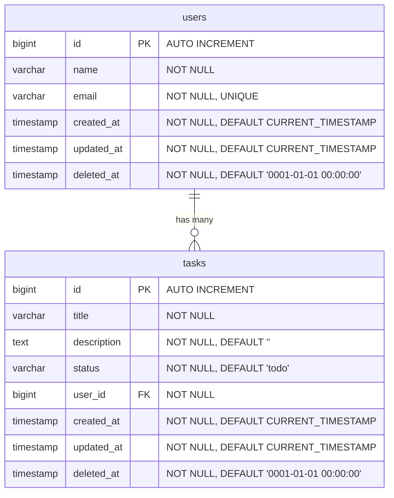

# 2-4. DB スキーマ定義 (Mermaid ER図)

## DB 設計ルール
- カラムは原則 NOT NULL 制約を付ける
- `created_at`, `updated_at` は全テーブル共通。初期値は `CURRENT_TIMESTAMP`
- `deleted_at` は全テーブル共通。初期値は timestamp 型のゼロ値 (`0001-01-01 00:00:00`)
- データ削除は**論理削除**方式とし、`deleted_at` を `CURRENT_TIMESTAMP` に更新する

## ER図

## テーブル定義

### users
| カラム | 型 | 制約 |
|-------|-----|------|
| id | BIGINT | PK, AUTO INCREMENT |
| name | VARCHAR | NOT NULL |
| email | VARCHAR | NOT NULL, UNIQUE |
| created_at | TIMESTAMP | NOT NULL, DEFAULT CURRENT_TIMESTAMP |
| updated_at | TIMESTAMP | NOT NULL, DEFAULT CURRENT_TIMESTAMP |
| deleted_at | TIMESTAMP | NOT NULL, DEFAULT '0001-01-01 00:00:00' |

### tasks
| カラム | 型 | 制約 |
|-------|-----|------|
| id | BIGINT | PK, AUTO INCREMENT |
| title | VARCHAR | NOT NULL |
| description | TEXT | NOT NULL, DEFAULT '' |
| status | VARCHAR | NOT NULL, DEFAULT 'todo' (todo / in_progress / done) |
| user_id | BIGINT | FK → users.id, NOT NULL |
| created_at | TIMESTAMP | NOT NULL, DEFAULT CURRENT_TIMESTAMP |
| updated_at | TIMESTAMP | NOT NULL, DEFAULT CURRENT_TIMESTAMP |
| deleted_at | TIMESTAMP | NOT NULL, DEFAULT '0001-01-01 00:00:00' |

### インデックス
- `tasks.user_id` に外部キーインデックス
