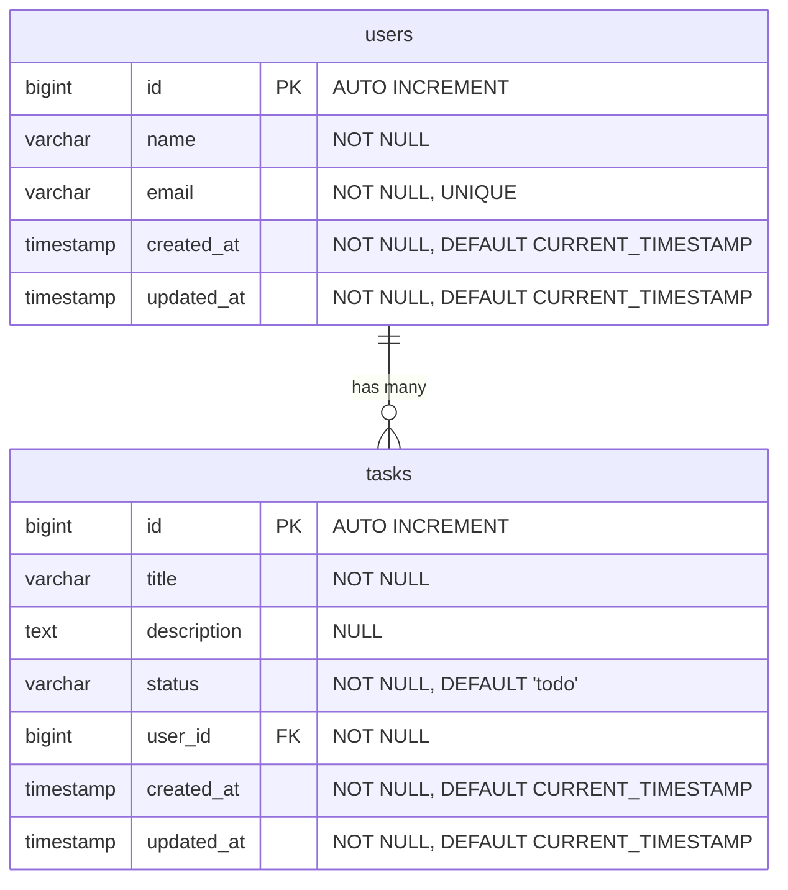

# 2-4. DB スキーマ定義 (Mermaid ER図)

## ER図

## テーブル定義

### users
| カラム | 型 | 制約 |
|-------|-----|------|
| id | BIGINT | PK, AUTO INCREMENT |
| name | VARCHAR | NOT NULL |
| email | VARCHAR | NOT NULL, UNIQUE |
| created_at | TIMESTAMP | NOT NULL, DEFAULT CURRENT_TIMESTAMP |
| updated_at | TIMESTAMP | NOT NULL, DEFAULT CURRENT_TIMESTAMP |

### tasks
| カラム | 型 | 制約 |
|-------|-----|------|
| id | BIGINT | PK, AUTO INCREMENT |
| title | VARCHAR | NOT NULL |
| description | TEXT | NULL |
| status | VARCHAR | NOT NULL, DEFAULT 'todo' (todo / in_progress / done) |
| user_id | BIGINT | FK → users.id, NOT NULL |
| created_at | TIMESTAMP | NOT NULL, DEFAULT CURRENT_TIMESTAMP |
| updated_at | TIMESTAMP | NOT NULL, DEFAULT CURRENT_TIMESTAMP |

### インデックス
- `tasks.user_id` に外部キーインデックス
